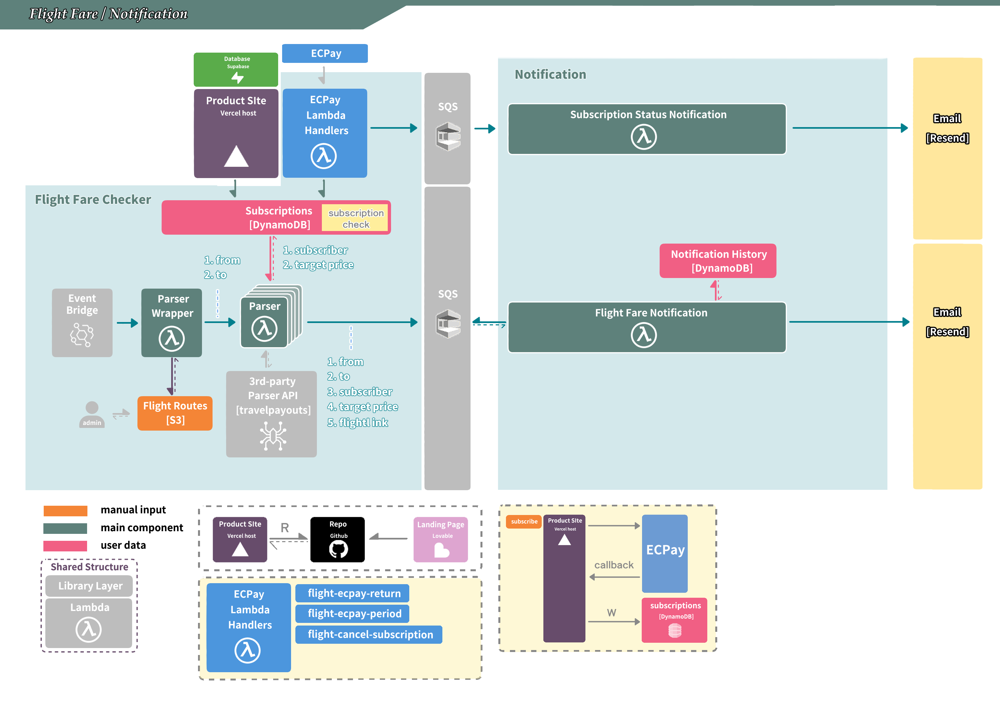

# M2 — ECPay 定期定額（接金流，只有付費者收得到通知）

## What this skill does

Turns the working **free** notifier (M1) into a **paid** service using **ECPay 綠界** — Taiwan's payment gateway, charging in **TWD**. **This is where the paywall is born** — M1 had no `subscription_status` and emailed anyone; M2 introduces the field, the callbacks that set it, and the parser filter that enforces it:

1. An ECPay **信用卡定期定額** (credit-card recurring) checkout — built as an **AIO auto-submit form**, not an SDK call.
2. `save_subscription` (from M1.1) now **writes `subscription_status = pending_payment`** AND builds the ECPay recurring-checkout form (signed with a **CheckMacValue**), returning its auto-submit HTML so the browser POSTs the user to ECPay's cashier to pay.
3. **Two callback Lambdas** behind API Gateway that **verify the CheckMacValue** (the SOURCE OF TRUTH for paid status) and flip the row's `subscription_status`:
   - **`flight-ecpay-return`** (`POST /ecpay-return`) — receives the **first** authorization result (paid at checkout) → `active`.
   - **`flight-ecpay-period`** (`POST /ecpay-period`) — receives **every subsequent monthly** authorization result → keeps `active`, or `expired` if ECPay reports the recurring run has ended.
   - both **enqueue a `{event_type:"welcome", …}` message to the status SQS queue** (the single `status_notification` consumer emails it — not inline).
4. A **`flight-cancel-subscription`** Lambda (`POST /cancel`) that calls ECPay's **`CreditCardPeriodAction` `Action=Cancel`** to stop future charges, flips the row to `expired`, and enqueues a `{event_type:"cancel", …}` message to the **same** status queue.

> **One notification consumer, routed by `event_type`.** Subscribe and unsubscribe emails both flow through the **same** `flight-status-notification` Lambda — every producer stamps an `event_type` (`"welcome"`/`"cancel"`) on the SQS message and the one consumer branches on it to render the right email. (Don't build two notification Lambdas.)
5. **The `flight-parser` (M1.2) gains an `active`-only filter** — its subscription scan now adds `AND subscription_status = active`. *This* is what makes only paying users get alerts.

End state: a test payment flips a row `pending_payment → active` (and it starts getting alerts); cancelling flips it to `expired` (alerts stop). A `pending_payment` (unpaid) row is never emailed.

> **Why ECPay, not Stripe?** This course targets a Taiwan audience charging in **TWD**. ECPay (綠界) is the standard local gateway and the one the instructor runs in production. The *shape* of M2 is identical to a Stripe paywall — payment flips a status field, a verified callback is the source of truth, the parser gates on `active` — but ECPay's mechanics differ in four ways you must learn (see "Things to watch out for"): **two callbacks instead of one webhook**, **CheckMacValue instead of a signature header**, **cancel is an API call you make, not an event you receive**, and **no SDK/layer needed** (CMV is stdlib `hashlib`).

## Architecture

![Flight Fare / Notification architecture (M2) — M2 adds the payment layer on top of the M1 notifier. The Product Site [Vercel] POSTs to the ECPay Lambda Handlers (flight-ecpay-return / flight-ecpay-period / flight-cancel-subscription), which talk to ECPay and write the subscription_status onto Subscriptions [DynamoDB]; a "subscription check" gate on that table is what makes the Parser scan only active rows. On payment events the handlers enqueue to the Notification-side SQS, where the Subscription Status Notification Lambda emails welcome/cancel via Resend. The M1 flow stays: EventBridge → Parser Wrapper → Parser (×N) reads Flight Routes [S3] + the 3rd-party travelpayouts API, scans Subscriptions, and enqueues matches to the Flight Fare Notification SQS → Flight Fare Notification Lambda dedups against Notification History [DynamoDB] and emails via Resend. Inset: the subscribe → ECPay → callback (W = write) loop that flips subscription_status. Legend: orange = manual input, teal = main component, pink = user data.](assets/flight_notification_structure2.jpg)

## When to load this skill

- "啟動 M2" / "start M2" / "接金流" / "接綠界" / "接 ECPay" / "做訂閱付款"

Requires M1 done (`m1-flight-price-checker-checklist` green — the free notifier works). Adds one account: **ECPay 綠界** (start with the shared stage test merchant).

## Execution mode

`aws` CLI + plain `curl`/`python3` here (ECPay has **no CLI** like Stripe's). Cowork: AWS MCP / the ECPay 廠商後台 (`vendor.ecpay.com.tw`) dashboard. `aws` commands `--region us-east-1`.

## Required external accounts (new)

| # | Service | Used for |
|---|---|---|
| 8 | ECPay 綠界 (`ecpay.com.tw`) | 信用卡定期定額 checkout + callbacks |

> For the whole course you can run on ECPay's **shared stage test merchant** — `MerchantID=3002607`, `HashKey=pwFHCqoQZGmho4w6`, `HashIV=EkRm7iFT261dpevs` (public, safe in code as defaults). Applying for a **real** MerchantID (and confirming 定期定額 is enabled on it) is M3 / [[ecpay-go-live]].

## Architecture



How the diagram maps to M2 (the boxes you build/upgrade this milestone):
- **ECPay Lambda Handlers** (legend, bottom-left) = `flight-ecpay-return` + `flight-ecpay-period` + `flight-cancel-subscription` — the callbacks that flip `subscription_status` (verified by CheckMacValue). The bottom-right inset shows the flow: `ECPay → callback → subscriptions [W]rite`.
- **subscription check** on the `Subscriptions [DynamoDB]` table = the parser's grace-aware gate (serves `active` + `cancelled`-in-grace) — the paywall.
- **Subscription Status Notification** (welcome/cancel) + **Flight Fare Notification** (price-drop) both go out via **Resend**; the status one is the single `event_type`-routed consumer.
- The **Product Site** sits on the generic **Vercel host** here — M3 ([[m3-domain]]) rebinds it to your own `[domain].com`.

The detailed flow:

```
訂閱表單 ─POST /subscribe─▶ save_subscription Lambda
                              · PutItem subscriptions（M2 起：status=pending_payment）
                              · 組 ECPay 定期定額 AIO 參數：
                                  ChoosePayment=Credit, TotalAmount=PeriodAmount=300（NT$300 月費，讀自 flight/ecpay 的 amount）,
                                  PeriodType=M, Frequency=1, ExecTimes=999,
                                  ReturnURL=<api>/ecpay-return, PeriodReturnURL=<api>/ecpay-period,
                                  MerchantTradeNo=<unique>, CustomField1=email, CustomField2=route
                              · 算 CheckMacValue（SHA256，stdlib hashlib — 不需 SDK / 不需 layer）
                              · 回 auto-submit HTML form ↩ 前端自動 POST 去 ECPay 收銀台
付款（第一期，當下立即授權）
   ├─ ReturnURL（S2S，幕後）──▶ flight-ecpay-return Lambda（paid 狀態的唯一真相來源）
   │                        · 驗 CheckMacValue + MerchantID + RtnCode==1
   │                        · active + 設 current_period_end → UpdateItem subscriptions
   │                        · SendMessage {event_type:"welcome",…} → [SQS status-queue]
   │                        · 回純文字 1|OK
   └─ OrderResultURL（瀏覽器 POST！不是 GET）──▶ flight-ecpay-result Lambda（ANY /ecpay-result）
                            · 302 Location: <site>/app?purchase=success  ← 不可直接指向靜態 SPA（會 405）
之後（第 2 期起，每月自動扣款）
   └─ PeriodReturnURL ──▶ flight-ecpay-period Lambda
                           · 驗 CMV；續扣成功 → 維持 active + 刷新 current_period_end
                           · 連續失敗 6 次 ECPay 自動終止 → expired（非首次失敗就 expired）· 回 1|OK
退訂（給寬限期，不是立刻 expired）
   └─ /account「取消訂閱」─POST /cancel─▶ flight-cancel-subscription Lambda
                           · POST ECPay CreditCardPeriodAction, Action=Cancel（帶原 MerchantTradeNo）
                           · status → cancelled（保留 current_period_end，期間內仍收得到）
                           · SendMessage {event_type:"cancel",…} → [SQS status-queue]
parser 閘門：服務 active ＋ cancelled-未過期；掃到 cancelled 且 current_period_end 已過 → 懶惰改 expired
                                              │
[SQS status-queue] ──▶ flight-status-notification Lambda（一支，依 event_type 分流）──▶ Resend
                          · "welcome" → 歡迎信   · "cancel" → 取消確認信
flight-parser（M1.2）的 scan 加上 AND subscription_status = active ← 付費門檻在這裡生效
```

## Conversational flow

### Step 1 — Store the ECPay merchant credentials

ECPay has no `products`/`prices` objects to create (unlike Stripe) — the **price is just the `TotalAmount` you put in the checkout form**. So Step 1 is only storing the merchant credentials + your monthly amount. **We implement a fixed monthly price of `NT$300`** — that's the `amount` we store in the secret and read at checkout. (Students can later change `amount` to any integer TWD value they want; everything downstream reads it from the secret, so the price is a one-line change with no code edits.) Store the secret (check-then-collect — skip if a previous session already created it). For the whole course you may use the public **stage test merchant**; paste to the agent:

ask """
>
Store the ECPay credentials in AWS Secrets Manager as `flight/ecpay`, with the monthly subscription price `amount` set to **`300`** (NT$300 — our implemented price; change this integer later if you want a different fee). Use the public **stage** test merchant (safe to commit) unless I gave you a real one. Region us-east-1. Check first, then create if missing:
>
```bash
aws secretsmanager describe-secret --secret-id flight/ecpay --region us-east-1 --query "Name"
```
>
- If that returns `flight/ecpay`, it already exists — confirm its `amount` is `300` (update if not); otherwise skip.
>
- If ResourceNotFoundException → `aws secretsmanager create-secret --name flight/ecpay --secret-string '{"merchant_id":"3002607","hash_key":"pwFHCqoQZGmho4w6","hash_iv":"EkRm7iFT261dpevs","env":"stage","amount":"300"}' --region us-east-1`
>
"""

**Verify before moving on:** `aws secretsmanager get-secret-value --secret-id flight/ecpay --region us-east-1 --query SecretString --output text` shows `merchant_id`, `hash_key`, `hash_iv`, `env:"stage"`, and `amount:"300"`.

### Step 2 — save_subscription: add the status field + build the recurring-checkout form

Update `aws/save_subscription/handler.py` (it had **no** status in M1). It needs a small **CheckMacValue helper** — **stdlib only** (`hashlib`, `urllib.parse`), so **no `stripe`/`requests` layer and no SDK** (a big simplification vs Stripe). See [[ecpay-best-practice]] Rule 2 for the exact CMV algorithm + the 7-character `ecpayUrlEncode` table.

1. On `PutItem`, **now write `subscription_status = "pending_payment"`** (the field is born here) plus a freshly generated unique **`MerchantTradeNo`** (≤20 chars; store it on the row — you need it later to cancel).
2. Build the ECPay AIO **定期定額** params and sign them:
   - `MerchantID` (from `flight/ecpay`), `MerchantTradeNo`, `MerchantTradeDate` (`yyyy/MM/dd HH:mm:ss`), `PaymentType=aio`, `ChoosePayment=Credit`, `EncryptType=1`
   - `TotalAmount=<amount>` **and** `PeriodAmount=<amount>` — **they must be equal** (ECPay rule). `amount` is read from the `flight/ecpay` secret — **`300` in our implementation (NT$300/month)**; never hard-code the number in the handler, always read it from the secret so changing the price stays a one-line secret update.
   - `PeriodType=M`, `Frequency=1`, `ExecTimes=999` (monthly; 999 ≈ "indefinite" — ECPay has no true ∞, see watch-out 6). **Hard-code `M`.** ⏩ *To test the renewal callback (Step 3) without waiting a month, temporarily change this one line to `PeriodType=D, Frequency=1, ExecTimes=2` and redeploy — ECPay then runs the 2nd charge the **next day** and POSTs a real (non-`SimulatePaid`) result to `PeriodReturnURL`. Revert to `M` after.* (`ExecTimes` must be ≥ 2 — ECPay rejects 1.)
   - `ItemName`, `TradeDesc` (avoid WAF keywords like `curl`/`python` — see [[ecpay-best-practice]])
   - `ReturnURL=<api>/ecpay-return`, `PeriodReturnURL=<api>/ecpay-period`, **`OrderResultURL=<api>/ecpay-result`** — ⚠️ **point `OrderResultURL` at a redirect Lambda, NOT the static SPA page.** ECPay delivers it as a **browser POST**; a static host returns **405** on a POST to a page route, so the user sees "This page isn't working" right after paying (the payment still succeeds via `ReturnURL`). See [[ecpay-best-practice]] Rule 11 + Step 3's `flight-ecpay-result`.
   - `CustomField1=email`, `CustomField2=route` — the join key the callbacks read to find the row
   - compute `CheckMacValue` over all of the above
3. Return an **auto-submit HTML form** (`<form action="https://payment-stage.ecpay.com.tw/Cashier/AioCheckOut/V5" method="post">` with one hidden input per field + a trailing **`<script>document.forms[0].submit()</script>`** — use the inline script, not just `onload`, so it fires reliably after the front-end does `document.write`). The browser POSTs it to ECPay. (Unlike Stripe you return *HTML*, not a JSON `checkout_url`.)
4. **Idempotency:** if the row already exists and is `active`, do NOT knock it back to `pending_payment` (preserve a paid user's status). Redeploy.

> **Front-end contract (the part that silently breaks):** the existing M1 front-end called `res.json()` on `/subscribe` — that throws the moment the Lambda returns `text/html`, and the button does nothing. The client must branch on `Content-Type`:
> - **`text/html`** → hand the browser to ECPay's cashier: `const html = await res.text(); document.open(); document.write(html); document.close();` (the returned form's inline `<script>…submit()</script>` then auto-POSTs to ECPay).
> - **`application/json`** → it's an in-place update (e.g. a `cancelled`-in-grace user updating their target price — no re-payment; see the lifecycle section). Update the card without navigating.

**Verify before moving on:** `POST /subscribe` writes a `pending_payment` row (with a `merchant_trade_no`) AND returns HTML whose `action` is the ECPay cashier and that contains a `CheckMacValue` hidden field.

> **👉 Once `save_subscription` actually pushes an order through ECPay's cashier** (i.e. you submit the returned form and pay the first period with the stage test card in Step 5), **confirm it landed at ECPay** in the stage backoffice:
> - Log into **`https://vendor-stage.ecpay.com.tw/`** (`stagetest3` / `test1234` / 統編 `00000000` — see [[m2-ecpay-subscription-prerequisites]]).
> - Go to **信用卡收單 → 定期定額查詢**. Filter **廠商訂單編號 = your `MerchantTradeNo`** (keep 狀態 / 週期種類 / 最新授權結果 = 全部; date range covers today) → 查詢.
> - Your recurring order appears with its 週期 + 已授權次數. (Per-period charge detail: **信用卡收單 → 交易明細查詢**, 交易類型 = 定期定額.)
> - **The page is empty until a real order exists** — it's a results page, so it'll be blank if you've only built `save_subscription` but not yet paid through the cashier. That's expected. It's also a **shared** backoffice (other testers' orders show too) — that's why you filter by your own `MerchantTradeNo`.
> - This is the same order you'll press **模擬付款** on to test the `PeriodReturnURL` renewal callback (Step 3 verify).

### Step 3 — Build the two callback Lambdas (the highest-risk files)

ECPay posts the **first** charge result to `ReturnURL` and **every subsequent** monthly charge to `PeriodReturnURL` — so you build **two** handlers. Both share the same verify-then-flip logic; factor it into one helper (mirrors how My Site's `processEcpayCallback` is shared by two routes).

**`aws/ecpay_return/handler.py`** (`POST /ecpay-return` — first period, source of truth for activation):
1. Read `flight/ecpay` from Secrets Manager.
2. Parse the **form-urlencoded** body (ECPay callbacks are `application/x-www-form-urlencoded`, **not** JSON; handle `isBase64Encoded`).
3. **Verify the CheckMacValue** over the returned fields — **keep empty-string fields in the hash** (ECPay sends `CustomField3=&CustomField4=` and signs them; dropping them gives a wrong hash — this is the single most common ECPay bug, see [[ecpay-best-practice]] Rule 2). Also verify `MerchantID` matches yours.
4. If `RtnCode == "1"` (string!) **and** not a bare `SimulatePaid=1` test (see watch-out 7): `UpdateItem` the `subscriptions` row keyed by `{email, route}` (from `CustomField1/2`) → `subscription_status=active`, store `merchant_trade_no`, and **set `current_period_end` = now + 1 period** (plus a human `current_period_end_date`) — you need this for the grace-period cancel.
5. **Idempotency: key on `MerchantTradeNo` + "is the row already `active`?", NOT on `gwsr`.** ⚠️ `Gwsr` came back **empty** on the real 定期定額 first-period callback (field naming differs from one-time AIO — verified live). If already activated for this trade-no, skip the write but still ack. (See [[ecpay-best-practice]] Rule 4.)
6. **Enqueue `{event_type:"welcome", email, route}` to the status SQS queue** (don't email inline — the single `flight-status-notification` consumer branches on `event_type`).
7. **Reply with the plain-text string `1|OK`, HTTP 200** (any other body → ECPay resends 4×). On a permanent failure (CMV invalid / merchant mismatch) reply `0|<reason>`.

**`aws/ecpay_period/handler.py`** (`POST /ecpay-period` — 2nd charge onward): same verify; on `RtnCode=="1"` keep `active` and **refresh `current_period_end`** (extend by one period — this is what makes the grace-period math work over time). On failure, **don't expire on the first miss** — ECPay auto-retries and only auto-terminates after **6 consecutive failures**; set `expired` only when the series has actually ended (see [[ecpay-best-practice]] Rule 10). Reply `1|OK`.

**`aws/ecpay_result/handler.py`** (`ANY /ecpay-result` — the browser-return redirect; **fixes the 405**): ECPay delivers `OrderResultURL` as a **browser POST**, and a static SPA returns **405** on a POST to a page route — so this tiny Lambda exists only to turn that POST into a redirect. It does **no** auth/activation (that's `ReturnURL`'s job). Read `RtnCode` from the POST body if you want success/fail branching, then return **`{"statusCode":302,"headers":{"Location":"https://<site>/app?purchase=success"}}`**. (See [[ecpay-best-practice]] Rule 11.)

Create the **status queue + its consumer** (mirrors the fare-queue pattern from M1.3) and the two routes:
```bash
aws sqs create-queue --queue-name flight-status-queue --region us-east-1
# flight-status-notification Lambda ← event-source mapping from flight-status-queue.
#   ONE consumer for both subscribe + unsubscribe: it reads message["event_type"]
#   ("welcome"|"cancel") and renders/sends the matching email via Resend. Don't build two.
# extend flight-lambda-role: sqs SendMessage (return/period/cancel Lambdas) + Receive/Delete (consumer) on flight-status-queue

# routes on the existing flight-api:
#   POST /ecpay-return  → flight-ecpay-return    (S2S, source of truth)
#   POST /ecpay-period  → flight-ecpay-period    (renewals)
#   ANY  /ecpay-result  → flight-ecpay-result    (browser POST → 302 redirect; fixes the 405)
#   POST /cancel        → flight-cancel-subscription (Step 6)
for fn in flight-ecpay-return flight-ecpay-period flight-ecpay-result; do
  route=${fn#flight-}   # ecpay-return / ecpay-period / ecpay-result
  aws lambda add-permission --function-name $fn \
    --statement-id apigw-$route --action lambda:InvokeFunction \
    --principal apigateway.amazonaws.com \
    --source-arn "arn:aws:execute-api:us-east-1:<ACCOUNT_ID>:<ApiId>/*/*/$route" \
    --region us-east-1
done
```

**Verify before moving on:** there's **no `stripe listen` equivalent** — ECPay needs a publicly reachable URL, so test against the deployed API (see [[ecpay-best-practice]] Rule 8).

**(a) `ReturnURL` — the first charge (`flight-ecpay-return`):** do a **real stage test-card** run through the form (Step 5). Watch `aws logs tail /aws/lambda/flight-ecpay-return --since 5m --region us-east-1` for CMV-verified + `UpdateItem → active`.

**(b) `PeriodReturnURL` — the renewal (`flight-ecpay-period`): use a daily period, verify next day (preferred — no manual backoffice step).**
1. Temporarily set the checkout to `PeriodType=D, Frequency=1, ExecTimes=2` (Step 2) and redeploy `save_subscription`.
2. Pay the **first** period with the test card — **it must succeed**, because *「若第一次授權失敗,此訂單不會進入排程」* (a failed first auth never enters ECPay's scheduler — you'd get no renewal at all).
3. **The next day**, ECPay's scheduler runs the 2nd charge and POSTs a **real** result (no `SimulatePaid`) to `PeriodReturnURL`. Check `aws logs tail /aws/lambda/flight-ecpay-period --since 24h --region us-east-1` → CMV-verified, replied `1|OK`, `TotalSuccessTimes=2`.
4. Revert to `PeriodType=M` and redeploy.

> *Alternative (manual, faster but less faithful):* press **模擬付款** on the order in the stage 後台 → it POSTs `SimulatePaid=1` to `PeriodReturnURL`. This proves the Lambda is **reached + CMV-verifies + returns `1|OK`**, but because watch-out 7 makes the handler ignore `SimulatePaid`, it does **not** exercise the real renewal-bookkeeping path. The daily-period method above is the real test.

### Step 4 — Turn ON the paywall: add the grace-aware gate to the parser

This is the step that actually gates alerts — and it's **not** a plain `status == active` filter, because cancellation grants a grace period (Step 6). Edit `aws/parser/handler.py` (from M1.2) so a row is served if:

- `subscription_status == "active"`, **OR**
- `subscription_status == "cancelled"` **AND** `current_period_end >= now` (still paid-through — keep alerting).

And because the parser scans every row anyway, make it the place that **lazily retires** grace-expired rows: when it sees a `cancelled` row whose `current_period_end < now`, `UpdateItem` it → `expired`. (`pending_payment`/`expired` are never served.) Redeploy the parser. See [[ecpay-best-practice]] Rule 12.

Now: only paid (`active`) and cancelled-but-still-in-period subscribers are enqueued. (Old M1 rows that have no `subscription_status` at all also stop matching — re-subscribe + pay to make them `active`.)

**Verify before moving on:** a `pending_payment` row whose target is met is NOT enqueued; an `active` row IS; a `cancelled` row with a **future** `current_period_end` IS (grace); and a `cancelled` row with a **past** `current_period_end` gets flipped to `expired` and is NOT enqueued.

### Step 5 — Test a real recurring payment end-to-end

ECPay callbacks need a **public** URL, so test against the **deployed** API (there's no local-forwarding tool). Run the full flow: submit the form (writes a `pending_payment` row + returns the auto-submit HTML) → the browser lands on ECPay's cashier → pay with the **stage test card** `4311-9522-2222-2222`, expiry `12/30`, CVV `222`, OTP `1234` → land back on `/account?purchase=success` → confirm the row flips to `active` (the first-period `ReturnURL` callback did it).

**Verify before moving on:**
```bash
aws dynamodb get-item --table-name subscriptions \
  --key '{"email":{"S":"<payer>"},"route":{"S":"TPE-TYO"}}' \
  --region us-east-1
```
Shows `subscription_status=active`, `merchant_trade_no` + `current_period_end` set. Then invoke the parser → the now-active row is enqueued and emailed (if at/below target). A `pending_payment` payer is NOT. (Note: `OrderResultURL` lands the browser via the `flight-ecpay-result` redirect — if you instead see a **405** right after paying, your `OrderResultURL` is pointing at the static SPA; fix per Step 2 / [[ecpay-best-practice]] Rule 11. The payment still succeeded.)

### Step 6 — Build + test cancellation (an API call, not an event)

Unlike Stripe (where a dashboard cancel *fires* `customer.subscription.deleted`), ECPay cancellation is something **you call** — and it grants a **grace period**, it does NOT expire instantly. Build `aws/cancel_subscription/handler.py` (`POST /cancel`):
1. Look up the row's stored `merchant_trade_no`.
2. `POST` to `https://payment-stage.ecpay.com.tw/Cashier/CreditCardPeriodAction` with `MerchantID`, `MerchantTradeNo`, `Action=Cancel`, `TimeStamp`, and a `CheckMacValue` over them. *(Stage cancel of a never-paid synthetic order returns `90100150 不存在的訂單編號` — that's expected; **log it and still cancel locally**.)*
3. `UpdateItem` the row → **`subscription_status=cancelled`** (a transition state — **NOT `expired`**), **keep `current_period_end`** so the parser keeps serving them until the period lapses. **Migration fallback:** if the row has no `current_period_end` (activated before period-tracking existed), set it to **`now + 1 month`** so the parser doesn't expire them on its next run.
4. Enqueue `{event_type:"cancel", email, route}` to the **same** `flight-status-queue` (the one `flight-status-notification` consumer sends the cancel email).

> **A `cancelled`-in-grace user can still update their target price** — that's an in-place `/subscribe` update (JSON response, no re-payment, status stays `cancelled`); their watch is live until the period ends.

Wire a 「取消訂閱」 button on `/account` to `POST /cancel`. Then test:
```bash
curl -s -X POST "<api>/cancel" -H "content-type: application/json" \
  -d '{"email":"<payer>","route":"TPE-TYO"}'
```
**Verify:** the row flips to **`cancelled`** with `current_period_end` preserved; the parser **still enqueues it** (grace) until that date passes, then lazily flips it to `expired` (Step 4). In the ECPay 廠商後台 → 信用卡定期定額訂單查詢, the order shows terminated (no more renewals). See the lifecycle diagram in [[ecpay-best-practice]] Rule 9.

### Step 7 — Status-aware UI + the M1→M2 migration

`flight-list-subscriptions` (from M1.1) already returns the full row including `subscription_status` — but the M1 front-end **ignored it and treated any row as 已訂閱**, so an unpaid `pending_payment` row wrongly showed as subscribed. Make the cards **status-aware**:

| `subscription_status` | Card shows |
|---|---|
| `active` | 已訂閱 (有效) |
| `pending_payment` | 未完成付款 + a **「完成付款 / Pay」** button (re-runs `/subscribe` → cashier) |
| `cancelled` | 已取消 · **有效至 `current_period_end_date`**（仍會通知到該日） |
| `expired` | 已結束 + a 重新訂閱 button |

**Migration: keep, don't delete.** Don't delete legacy/unpaid M1 rows on the M2 cutover. Surface them as `pending_payment` with the 完成付款 reminder so users **self-migrate** by paying. (Also backfill any pre-existing `active` rows with a `current_period_end` so the grace-period math works — see Step 6.)

> **Subscription lifecycle (one line to remember):** `pending_payment → active ⇄ (target updates) → cancelled (grace, still alerted) → expired`. Re-subscribe+pay goes `expired/pending_payment → active`. Full state machine: [[ecpay-best-practice]] Rule 9.

> **Deploy convention (Cowork):** these Lambdas deploy as **single-file `index.handler`** via inline CloudFormation (≤4096 chars) or the **`flight-seed`/`flight-assemble` base64→S3 bridge** for bigger zips — **not** `aws/<fn>/handler.py` + `zip --zip-file fileb://` (the Cowork sandbox has no AWS network route). Any zip over ~1.5 KB MUST go chunked-with-ETag-verification — see [[aws-best-practice]] (a single long base64 `--payload` silently corrupts; only an ETag==md5 gate catches it). The live M2 sources are single-file.

## Things to watch out for

1. **CheckMacValue, not a signature header** — every ECPay callback carries a `CheckMacValue`; verify it on **every** call. The #1 ECPay bug: **dropping empty-string fields** before hashing. ECPay sends (and signs) `CustomField3=&CustomField4=`; your verify must keep them. Drop only `CheckMacValue` itself and truly-absent keys. (See [[ecpay-best-practice]] Rule 2.)
2. **Two callbacks, not one webhook** — first charge → `ReturnURL`; 2nd-onward → `PeriodReturnURL`. **Both** must verify CMV and flip status. If you only build `ReturnURL`, renewals silently never update.
3. **Reply `1|OK` plain text** — anything else (JSON, HTML, quotes, even `OK`) makes ECPay resend the callback 4× over ~20–60 min. Use a `text/plain` response. (See [[ecpay-best-practice]] Rule 3.)
4. **`CustomField1/2` are the join key** — put `email` + `route` there in the checkout form so the callbacks know which DynamoDB row (`{email, route}`) to `UpdateItem`. ECPay echoes them back. (Equivalent to Stripe's metadata — see [[ecpay-best-practice]] Rule 5.)
5. **Callbacks = source of truth** — only the `flight-ecpay-return`/`flight-ecpay-period` Lambdas write `active`. `save_subscription` only writes `pending_payment`; the `OrderResultURL` browser-redirect page is UX-only and must never activate. (See [[ecpay-best-practice]] Rule 1.)
6. **No true "indefinite" subscription** — ECPay's `ExecTimes` is a *count* (`M`: max 999). We use `ExecTimes=999` as "effectively long-term," not infinite-like-Stripe. `PeriodAmount` must equal `TotalAmount`. (See [[ecpay-best-practice]] Rule 6.)
7. **Guard `SimulatePaid`** — the stage 後台「模擬付款」 button (great for testing the callback) sends `SimulatePaid=1`. Verify the CMV and reply `1|OK`, but **do not write `active`** for a bare simulate — else anyone hitting simulate gets the product free. (See [[ecpay-best-practice]] Rule 7.)
8. **The gate lives in the parser, and it's grace-aware** — payment alone doesn't stop emails; the **parser (Step 4)** enforces it, serving `active` **and** `cancelled`-in-grace, and lazily expiring grace-lapsed rows. Skip Step 4 and everyone still gets emailed (M1 behavior). (See [[ecpay-best-practice]] Rule 12.)
9. **Cancel grants a grace period — sets `cancelled`, NOT `expired`** — `CreditCardPeriodAction Action=Cancel` stops *renewals*, but the user keeps service through `current_period_end`. Track + refresh `current_period_end` on every charge; cancel keeps it; the parser expires later. There's no Stripe Customer Portal — the self-service 退訂 is your `/cancel` Lambda. (See [[ecpay-best-practice]] Rule 9.)
10. **`OrderResultURL` is a browser POST → 405 on a static SPA** — point it at the `flight-ecpay-result` 302-redirect Lambda, never the SPA page. A 405 right after paying is a UX bug, not a payment bug (the row still activated via `ReturnURL`). (See [[ecpay-best-practice]] Rule 11.)
11. **Idempotency on `MerchantTradeNo`, not `gwsr`** — `Gwsr` is **empty** on the real recurring first-period callback. Key on the trade-no + "already active?" (See [[ecpay-best-practice]] Rule 4.)
12. **Front-end must branch on `Content-Type`** — `/subscribe` returns `text/html` (→ `document.write` to ECPay) or `application/json` (→ in-place update). `res.json()` on the HTML silently breaks the button. (Step 2.)
13. **No SDK, no layer** — CMV is `hashlib.sha256` (use the official `ecpayUrlEncode` — `~`→`%7E` — and validate against `ecpay/test-vectors/`); the cancel POST is `urllib`. Lambdas stay stdlib + boto3, single-file `index.handler`. (See [[aws-best-practice]] + [[ecpay-best-practice]] Rule 2.)
14. **TWD is a whole-number currency in ECPay** — our `TotalAmount=300` means exactly NT$300/month (no ×100 cents trap). The value lives in the `flight/ecpay` secret's `amount`, so changing the price is a one-line secret update, not a code change. But ECPay silently hides credit-card payment below the card minimum (~NT$6–11) — don't drop it that low / don't test with NT$1.
15. **Resend sandbox only reaches your own account email** — test M2's welcome/cancel emails **to yourself**; other recipients 403 until you verify a domain (M3). (See [[resend-best-practice]].)
16. **Stage vs prod** — M2 runs entirely on the **stage** merchant + cashier URL (`payment-stage.ecpay.com.tw`). Applying for a real MerchantID + confirming 定期定額 is enabled + switching to `payment.ecpay.com.tw` is **M3** ([[ecpay-go-live]]).

## Expected duration

90–120 minutes (the CheckMacValue + the two-callback split are fiddly the first time).

## Next step

When `m2-ecpay-subscription-checklist` is green: 「M2 完成！只有付費者收得到通知，取消就停。你的產品會賺錢了。跟我說『啟動 M3』，我們把它掛到你自己的網域、正式開張。」Then load `m3-domain`.

## Reference

- ECPay 信用卡定期定額: https://developers.ecpay.com.tw/?p=2868
- 定期定額付款結果通知 (ReturnURL 第一期 / PeriodReturnURL 第二期起): https://developers.ecpay.com.tw/?p=5631
- 信用卡定期定額訂單作業 (CreditCardPeriodAction，取消): https://developers.ecpay.com.tw/?p=2900
- CheckMacValue 機制: https://developers.ecpay.com.tw/?p=2902
- [[ecpay-best-practice]] — the callback hard rules (CMV, empty-string fields, `1|OK`, two callbacks, SimulatePaid) for THIS course's Lambda model.
- [[aws-best-practice]] — where `flight/ecpay` lives; the form-body/`isBase64Encoded` rule from the AWS side; why no layer is needed.
- [[ecpay-go-live]] — applying for a real MerchantID + switching to prod in M3.
